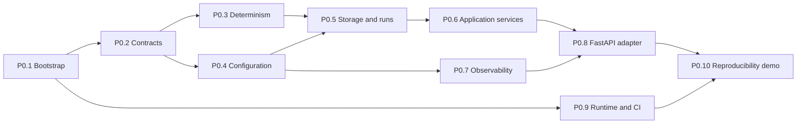

# Phase 0 Implementation Plan: Foundation and Reproducibility

**Status:** Revised proposal  
**Parent plan:** [RAG Application Development Plan](./RAG_APPLICATION_DEVELOPMENT_PLAN.md)  
**Architecture:** [Repository Structure and Architecture Proposal](./REPOSITORY_STRUCTURE_PROPOSAL.md)

## 1. Objective

Build the smallest working foundation needed for reproducible RAG development. At the end of Phase 0, configuration validates at startup, canonical contracts and deterministic manifests are executable, queued run records can be created and inspected through shared application services and FastAPI, structured correlation data appears in logs, and local/CI tests prove the behavior.

Phase 0 establishes an application-service boundary beneath FastAPI so the future evaluation runner can call the same use cases directly. It does not implement the future query pipeline.

## 2. Scope Guardrail

Phase 0 builds only:

- Configuration and feature flags
- Canonical domain contracts
- Deterministic IDs, serialization, and manifests
- Run metadata and status lifecycle
- A local artifact store for immutable manifests
- Working shared application services for run creation/inspection and readiness
- A FastAPI adapter over those application services
- Structured logging and tracing interfaces
- Docker Compose, CI, and tests

Phase 0 does **not** create placeholder implementations for ingestion, indexing, retrieval, routing, HyDE, hierarchy, multi-hop, generation, evaluation, workers, or dynamic providers. Those packages are added with their first working capability and tests.

## 3. Architectural Constraints Established Now

The following decisions are enforced from Phase 0 even though their full capabilities arrive later:

1. **Shared application core:** FastAPI, the future evaluator, CLI tools, and workers are peer inbound adapters over application services.
2. **Direct evaluation:** The future evaluation runner calls `QueryApplicationService` in process. HTTP is used only for explicit end-to-end tests.
3. **Advanced retrieval placement:** Query rewrite and strategy selection precede retrieval. HyDE is pre-retrieval transformation, hierarchy is a retrieval strategy, and multi-hop is a bounded retrieval/reranking loop.
4. **Immutable raw input:** Original source bytes are stored before parsing with a source version and checksum.
5. **Structure before enrichment:** Document hierarchy and parent links exist before contextual headers are generated.
6. **Separated benchmark assets:** Corpus documents, queries, qrels/evidence, and expected answers are distinct contracts and streams.
7. **Pinned index identity:** Every future query/evaluation records the exact resolved physical index version, not only the logical `active` alias.
8. **Two evidence gates:** Retrieval sufficiency is checked before generation, and claim/citation support is validated afterward.
9. **Separated storage:** Operational metadata, artifacts, indexes, telemetry, and caches have distinct interfaces.
10. **Asynchronous run shape:** Long-running APIs create queued work and return; a later worker performs it.

## 4. Phase 0 Materialized Repository

Only these application modules are created in Phase 0:

```text
src/rag_app/
├── __init__.py
├── main.py
├── api/
│   ├── app.py
│   ├── dependencies.py
│   ├── errors.py
│   ├── middleware.py
│   └── routes/
│       ├── health.py
│       └── runs.py
├── application/
│   ├── ports.py
│   ├── readiness.py
│   └── runs.py
├── config/
│   ├── loader.py
│   └── models.py
├── domain/
│   ├── benchmarks.py
│   ├── documents.py
│   ├── errors.py
│   ├── experiments.py
│   ├── identifiers.py
│   ├── indexes.py
│   ├── queries.py
│   └── runs.py
├── observability/
│   ├── context.py
│   └── logging.py
└── infrastructure/
    ├── artifacts/local.py
    ├── opensearch/health.py
    └── sqlite/
        ├── migrations/
        └── runs.py
```

The future `application/queries.py` is not created until a real query use case exists. Its command/result boundary is established through the Phase 0 query domain contracts and the architecture decision that all adapters must call the same service.

## 5. Fixed Technical Decisions

| Concern | Phase 0 decision |
| --- | --- |
| Runtime | Python 3.12+ |
| Packaging | `uv`, `pyproject.toml`, locked dependencies, `src` layout |
| Inbound HTTP adapter | FastAPI application factory |
| Application layer | Framework-neutral use-case services |
| Settings | Typed settings loaded at composition time; `RAG_` environment prefix |
| Metadata | SQLite through a narrow run-repository protocol |
| Artifacts | Local versioned artifact store through a separate protocol |
| Telemetry | Structured JSON and OpenTelemetry-compatible interfaces; not SQLite |
| Search dependency | Pinned OpenSearch container and health adapter only |
| Serialization | Canonical JSON for content-addressed records |
| Hashes | SHA-256 with explicit artifact/schema version prefixes |
| Time | UTC, timezone-aware timestamps at boundaries |
| Tests | pytest unit, integration, and golden suites; regression suite added later |
| Orchestration | Explicit application services; no agent or graph framework |

## 6. Work Breakdown

### P0.1 — Bootstrap Only the Foundation

**Tasks**

1. Confirm whether this directory is the intended Git root; initialize Git only after confirmation.
2. Add `pyproject.toml` with Python version, package metadata, and executable entry points.
3. Add the minimum runtime dependencies for FastAPI, typed settings, ASGI serving, structured logging, and telemetry interfaces.
4. Add development dependencies for pytest, coverage, formatting, linting, and static typing.
5. Generate and commit `uv.lock`.
6. Create only the Phase 0 materialized tree in Section 4.
7. Add `.gitignore`, `.env.example`, `README.md`, `compose.yaml`, and CI configuration.
8. Move the existing data-collection notebook to `notebooks/data_collection/` in a dedicated change.
9. Do not create empty later-phase packages.

**Verification**

```bash
uv sync --frozen
uv run python -c "import rag_app"
uv run pytest tests/unit
```

**Done when**

- A clean checkout installs from the lockfile.
- The package imports only as an installed `src` package.
- All created modules have working behavior and tests.
- Corpora, raw snapshots, indexes, databases, telemetry files, caches, and secrets are ignored.

### P0.2 — Define Canonical Contracts Without Implementing Pipelines

**Tasks**

Implement Pydantic models or immutable dataclasses for the stable data boundaries.

**Source and document contracts**

- `RawSourceSnapshot`: immutable artifact URI, exact byte checksum, byte length, media type, source URI/key, source version, and capture timestamp
- `Document` and `DocumentNode`: canonical parsed content, hierarchy, locators, source snapshot reference, reserved `tenant_id` and `access_tags`
- `Chunk`: raw evidence, stable parent link, locator, contextual retrieval text kept separate from raw text

The raw snapshot contract must make it possible to rerun future parser/chunker versions from the original bytes.

**Benchmark contracts**

- `CorpusDocument`
- `BenchmarkQuery`
- `RelevanceJudgment` or gold-evidence record
- `ExpectedAnswer` or expected label
- Dataset/split/version descriptor

These remain separate. A composed `BenchmarkExample` may be an evaluation view, but it is never passed to ingestion as a document.

**Experiment and index contracts**

- `ExperimentConfig` and immutable `ExperimentManifest`
- `LogicalIndexReference` and `ResolvedIndexReference`
- `IndexManifestReference` containing the exact physical index and corpus snapshot version

`ResolvedIndexReference` must distinguish the logical alias from the physical index selected at resolution time.

**Run and query contracts**

- `RunRecord`, `RunType`, `RunStatus`, and artifact references
- Provider-neutral future query command and result
- Evidence, citation, abstention, and stable reason codes

The query result reserves exact trace, configuration, experiment, and resolved-index identifiers.

**Contract rules**

- Reject malformed and inconsistent values at boundaries.
- Use timezone-aware UTC timestamps.
- Version all persisted schemas.
- Keep provider SDK types outside domain models.
- Mark fields that can contain source text or sensitive values.
- Never model a generated contextual header or HyDE passage as evidence.

**Tests**

- Valid construction and serialization round trips
- Rejection of invalid enum, timestamp, hierarchy, checksum, and index-reference states
- Raw evidence remains distinct from generated retrieval context
- Benchmark assets cannot be confused by type
- Logical and resolved index references cannot be substituted silently
- JSON Schema generation for persisted and API-boundary contracts

**Done when**

- The contracts encode the corrected ingestion, benchmark, index, and query boundaries.
- Domain code imports no FastAPI, OpenSearch, SQLite, or model SDK.
- No parser, retriever, generator, evaluator, or worker implementation exists.

### P0.3 — Implement Deterministic Identity and Serialization

**Tasks**

1. Define canonical JSON: UTF-8, sorted keys, stable separators, normalized enums, explicit null policy, and UTC timestamps.
2. Add SHA-256 helpers with explicit type/schema prefixes.
3. Define identities for:
   - Raw snapshots from exact original bytes plus the identity schema version
   - Documents from source namespace and stable external key
   - Content from the explicitly versioned normalization output
   - Chunks from document ID, chunker version, hierarchy level, and stable locator
   - Experiments from canonical experiment configuration
   - Manifests from the complete canonical identity-bearing payload
4. Exclude secrets and volatile execution fields from identity hashes.
5. Include parser, chunker, contextualizer, embedding, prompt, dataset, and schema versions as optional manifest fields that become required when their capabilities are enabled.
6. Document byte-level versus normalized-content hashes; do not conflate them.

**Tests**

- Reordered keys produce the same hash.
- Repeated execution produces byte-identical serialization.
- One changed identity-bearing version changes the manifest hash.
- Creation timestamps and secrets do not change content-addressed identities unless specified.
- Original byte hash and normalized content hash are independently represented.
- Golden fixtures lock formats and values.

**Done when**

- Determinism is proven by golden tests.
- Every persisted hash declares the algorithm and identity schema version.
- Hash format changes require an explicit schema increment.

### P0.4 — Add Typed Configuration and Feature Flags

**Tasks**

Create typed settings for:

- Application and API
- SQLite metadata
- Artifact storage
- OpenSearch health/connectivity
- Future model/provider references
- Future ingestion/indexing versions
- Retrieval and reranking budgets
- Strategy selection and maximum multi-hop steps
- Pre-generation sufficiency and post-generation support thresholds
- Dynamic-provider timeouts, cache policy, and failure behavior
- Evaluation and observability
- Feature flags

At minimum, reserve typed flags for:

```text
semantic_chunking
contextual_headers
dense_retrieval
sparse_retrieval
reranking
metadata_filtering
hierarchical_retrieval
query_rewriting
hyde
multi_hop
dynamic_retrieval
generation
retrieval_sufficiency_gate
citation_support_gate
```

All unimplemented capabilities default to disabled. Cross-field validation applies only when a capability is enabled; Phase 0 must start successfully with query execution disabled.

Add a secret-safe `rag-inspect-config` command that prints the resolved configuration with secrets redacted.

**Tests**

- Defaults load with all unimplemented capabilities disabled.
- Environment variables override checked-in defaults.
- Enabling a capability without its required configuration fails at startup.
- Negative timeouts, non-positive limits, and invalid storage paths fail validation.
- Secrets are redacted from display, logs, and manifests.
- Feature values appear in experiment configuration snapshots.

**Done when**

- No model, prompt, path, threshold, provider, or endpoint identifier is hard-coded in application logic.
- Invalid configuration produces an actionable startup failure.
- Flags describe eventual capabilities without creating their implementations.

### P0.5 — Implement Metadata, Artifact, and Run Lifecycle Boundaries

**Tasks**

1. Define the storage split:
   - SQLite: run records, status, idempotency keys, experiment metadata, artifact references
   - Artifact store: immutable manifest JSON now; raw snapshots and reports later
   - Telemetry: structured events through observability interfaces, not SQLite
2. Implement a run-repository protocol and SQLite adapter with migrations.
3. Implement a local artifact-store protocol supporting atomic write, checksum verification, immutable addressing, and read-back.
4. Store complete manifests as artifacts; store their URI/checksum/reference in SQLite.
5. Define the normal run lifecycle:

```text
queued -> running -> succeeded
                  -> failed
queued/running -> cancelled
```

6. Enforce state transitions and immutable identity-bearing fields.
7. Implement idempotent run creation.
8. Define claim/lease fields needed by a future worker without building a queue or worker.
9. Record an exact `ResolvedIndexReference` on query/evaluation runs when query execution becomes available; never persist only `active` as the index identity.

**Tests**

- Valid and invalid state transitions
- Idempotent create behavior
- SQLite migration from an empty database
- Transaction rollback on failed writes
- Manifest atomic write, checksum verification, immutability, and reload
- SQLite records contain references rather than manifest/document blobs
- No trace/span tables are introduced

**Done when**

- Ingestion/evaluation run requests can be persisted as `queued` and inspected.
- Creating a run does not execute long-running work inside the caller.
- Identical configurations yield the same manifest artifact/hash but distinct execution run IDs.

### P0.6 — Implement Working Shared Application Services

**Tasks**

1. Implement `RunApplicationService` with working use cases for:
   - Create a queued ingestion or evaluation run
   - Retrieve a run
   - Apply tested lifecycle transitions for future executors
2. Implement `ReadinessApplicationService` over narrow dependency-health protocols.
3. Keep transaction, idempotency, manifest persistence, and error mapping decisions in the application layer rather than route handlers.
4. Wire services through an explicit composition root.
5. Define and test application command/result objects independent of HTTP.
6. Record an architecture decision that the future `QueryApplicationService` is the single query entry point for FastAPI and evaluation.
7. Do not implement a fake query service or evaluation runner in Phase 0.

**Tests**

- Application services work directly without FastAPI.
- Fake repositories/artifact stores can be injected.
- A manifest failure does not leave a partially created run.
- Duplicate idempotency keys return the original run.
- Readiness reports dependency-specific states.
- No application module imports FastAPI.

**Done when**

- Phase 0 behavior is usable through the shared application layer.
- HTTP is demonstrably an adapter rather than the use-case implementation.
- The future evaluator can call the same architectural boundary without depending on FastAPI.

### P0.7 — Establish Observability Without Using SQLite as a Trace Store

**Tasks**

1. Generate or propagate `trace_id` for every HTTP request and application-service call.
2. Carry `run_id`, `query_id`, and `experiment_id` when applicable using request-safe context variables.
3. Configure structured JSON logs with event name, timestamp, severity, stage, duration, outcome, and stable reason code.
4. Define OpenTelemetry-compatible span/metric interfaces for future pipeline and provider calls.
5. Define conventions for latency, tokens, cost, cache, retries, provider failures, and index version.
6. Add default-deny redaction and size limits for secrets, raw source bytes, documents, prompts, contexts, and provider payloads.
7. Emit logs locally in Phase 0; do not implement trace persistence in SQLite.

**Tests**

- Correlation IDs appear on API and application-service events.
- Concurrent requests do not leak context.
- Secrets and source-like payloads do not appear in captured logs.
- Stable reason codes survive exception mapping.
- Metadata repositories contain no trace/span records.

**Done when**

- A Phase 0 request can be followed through API and application layers by trace ID in logs.
- A future telemetry exporter can be attached without changing application contracts.

### P0.8 — Build FastAPI as an Inbound Adapter

**Tasks**

1. Implement a FastAPI application factory with injected application services.
2. Add trace/timing middleware and consistent machine-readable errors.
3. Implement only these Phase 0 endpoints:

| Endpoint | Phase 0 behavior |
| --- | --- |
| `GET /healthz` | Process liveness only |
| `GET /readyz` | Delegate dependency readiness to `ReadinessApplicationService` |
| `POST /v1/ingestion-runs` | Validate and create a queued run; return `202` with ID/location |
| `GET /v1/ingestion-runs/{id}` | Delegate run inspection |
| `POST /v1/evaluation-runs` | Validate and create a queued run; return `202` with ID/location |
| `GET /v1/evaluation-runs/{id}` | Delegate run inspection and artifact references |

4. Do not expose `POST /v1/query` until a real query service exists.
5. Do not expose `GET /v1/traces/{id}` until a telemetry backend supports trace retrieval.
6. Do not execute ingestion or evaluation inside the POST request.
7. Publish API/schema versions through OpenAPI and response metadata.

**Tests**

- Route tests use injected fake application services.
- Separate tests call the real application service without HTTP.
- Health stays live when dependencies fail; readiness reports precise failures.
- POST returns `202` and a queued record rather than performing work.
- Request validation, error mapping, and trace propagation are consistent.
- Route handlers do not import SQLite, artifact, OpenSearch, or future pipeline implementations.

**Done when**

- FastAPI is visibly a thin adapter.
- Long-running API semantics are asynchronous even though no queue/worker exists yet.
- OpenAPI matches the implemented capability rather than advertising placeholders.

### P0.9 — Add Reproducible Local Runtime and CI

**Local runtime tasks**

1. Add pinned API and single-node OpenSearch services to `compose.yaml`.
2. Add health checks, named volumes, and conservative local resource defaults.
3. Store SQLite and local artifacts in distinct mounted paths under `var/`.
4. Document macOS/Linux prerequisites and memory requirements.
5. Provide non-destructive start, inspect, and stop commands.

**Quality tasks**

1. Configure formatting, linting, static typing, pytest markers, and coverage.
2. Run unit and golden tests on every change.
3. Run SQLite, artifact-store, FastAPI, and OpenSearch-health integration tests with pinned versions.
4. Add dependency-lock, import-boundary, secret, and large-artifact checks.
5. Ensure CI never downloads full datasets or starts later-phase work.

**Recommended gate**

```bash
uv sync --frozen
uv run ruff format --check .
uv run ruff check .
uv run mypy src
uv run pytest tests/unit tests/golden
uv run pytest -m integration
docker compose config --quiet
```

**Done when**

- Local and CI checks use the same commands.
- A clean environment can start the API and pass health/readiness checks.
- Architecture/import tests prevent FastAPI coupling in application services.

### P0.10 — Demonstrate Reproducibility and Adapter Independence

**Tasks**

1. Document installation, configuration, startup, testing, storage locations, and troubleshooting.
2. Record architecture decisions for:
   - Shared application services beneath API/evaluation
   - Correct advanced-retrieval strategy placement
   - Immutable raw snapshots before parsing
   - Separate benchmark asset streams
   - Index validation, atomic promotion, exact resolution, and rollback
   - Storage responsibility separation
   - Queued run semantics
3. Add one non-secret example experiment configuration.
4. Add a smoke test that:
   - Loads and validates the configuration
   - Creates and persists an immutable manifest artifact
   - Creates a queued run through `RunApplicationService`
   - Retrieves the run directly through the service
   - Retrieves the same run through FastAPI
   - Repeats with the same configuration and verifies the same manifest identity plus a distinct execution ID
5. Do not claim that the queued run performed ingestion or evaluation.

**Done when**

- The behavior is reproducible from a clean checkout.
- Direct application-service and HTTP-adapter views agree.
- The demonstration proves foundation behavior without simulating a completed RAG pipeline.

## 7. Recommended Implementation Order



Recommended review increments:

1. Minimal project bootstrap and dependency lock
2. Corrected domain contracts and schema tests
3. Canonical serialization and golden hashes
4. Typed configuration with disabled future capabilities
5. Separate SQLite metadata and local artifact adapters
6. Working application services
7. Structured logging and redaction
8. Thin FastAPI adapter
9. Compose, integration tests, CI, and reproducibility demonstration

## 8. Acceptance Test Matrix

| Requirement | Evidence |
| --- | --- |
| FastAPI is not the application core | Run use-case tests execute without HTTP; API delegates to injected service |
| Future evaluation is not HTTP-coupled | Architecture/import decision and provider-neutral application commands |
| Advanced retrieval placement is unambiguous | Architecture contract/ADR shows pre-retrieval strategy selection and multi-hop loop |
| Original source and parsed content are distinct | `RawSourceSnapshot` and `Document` contract tests |
| Benchmark asset types remain separate | Static typing and schema tests for corpus/query/qrel/answer types |
| Exact index version is recordable | `ResolvedIndexReference` tests and manifest schema |
| Config validates at startup | Unit and startup-failure tests |
| Same inputs produce the same manifest | Golden canonical-hash tests |
| Executions have unique run IDs | Run-repository integration test |
| POST creates queued work only | API test returning `202` and `queued` |
| Metadata and artifacts remain separate | SQLite and artifact adapter contract tests |
| SQLite is not a trace store | Migration/schema assertion and observability tests |
| Secrets/source content stay out of logs | Redaction tests |
| Package boundaries remain framework-neutral | Import-boundary tests |
| Local environment is reproducible | Frozen install and Compose validation |
| No premature implementations exist | Repository tree assertion/review gate |

## 9. Phase 0 Exit Gate

Phase 0 is complete only when:

- [ ] A clean checkout installs from the committed lockfile.
- [ ] Only the Phase 0 materialized packages have been created.
- [ ] Canonical schemas cover raw snapshots, document hierarchy, separated benchmark assets, resolved indexes, experiments, queries, and runs.
- [ ] All unimplemented feature flags default to disabled.
- [ ] Configuration validates before traffic is accepted.
- [ ] Canonical manifests are byte-reproducible and content addressed.
- [ ] SQLite stores operational metadata and artifact references, not raw sources, large manifests, reports, traces, or spans.
- [ ] The local artifact store writes immutable manifests atomically and verifies checksums.
- [ ] Run creation is idempotent and persists `queued` without executing work.
- [ ] Shared application services work without FastAPI.
- [ ] FastAPI delegates all use-case decisions to application services.
- [ ] `/healthz` and `/readyz` have distinct, tested behavior.
- [ ] No query or trace-retrieval endpoint advertises an unimplemented capability.
- [ ] Structured logs propagate correlation IDs and redact secrets/source content.
- [ ] The future exact physical index reference is part of query/evaluation result and manifest contracts.
- [ ] Unit, golden, integration, typing, lint, formatting, and architecture gates pass.
- [ ] The reproducibility demonstration succeeds without claiming to execute ingestion or evaluation.
- [ ] Generated data, databases, telemetry, caches, and secrets are excluded from Git.

## 10. Risks and Mitigations

| Risk | Mitigation |
| --- | --- |
| Target diagram drives empty scaffolding | Maintain separate target and Phase 0 trees; add packages only with working behavior |
| FastAPI becomes the hidden application core | Direct application-service tests and import-boundary enforcement |
| Evaluator duplicates or calls the HTTP pipeline | One future `QueryApplicationService`; HTTP limited to E2E tests |
| Raw source cannot be reprocessed | Immutable byte snapshot contract before parser output |
| Dataset questions leak into ingestion | Distinct corpus/query/qrel/answer contracts and adapters |
| Runs follow an alias that changes mid-execution | Resolve once, pin exact physical index, persist it with results |
| SQLite accumulates artifacts or telemetry | Separate artifact/telemetry ports and schema assertions |
| POST requests become long-running jobs | Persist `queued`, return `202`, add workers only later |
| Feature flags imply capabilities that do not exist | Default disabled and reject enabling incomplete capabilities |
| Manifest identity is unstable | Canonical serialization, volatile-field policy, golden tests |

## 11. Handoff to Later Phases

Phase 1 consumes the snapshot, document, benchmark asset, configuration, manifest, run, artifact, and observability foundations to implement real dataset adapters. It must expose corpus documents separately from queries, qrels, and answers.

Phase 2 adds real ingestion and indexing packages in this order: immutable source capture, parsing to a document tree, hierarchy/parent links, chunking, contextual enrichment, embeddings, immutable index build, validation, and atomic alias promotion/rollback.

The first query-capable phase adds the single `QueryApplicationService`. FastAPI and the evaluator both call it. Routing selects standard, HyDE, hierarchical, or bounded multi-hop strategy before/around retrieval, followed by the shared evidence-sufficiency, generation, and citation-support stages.
