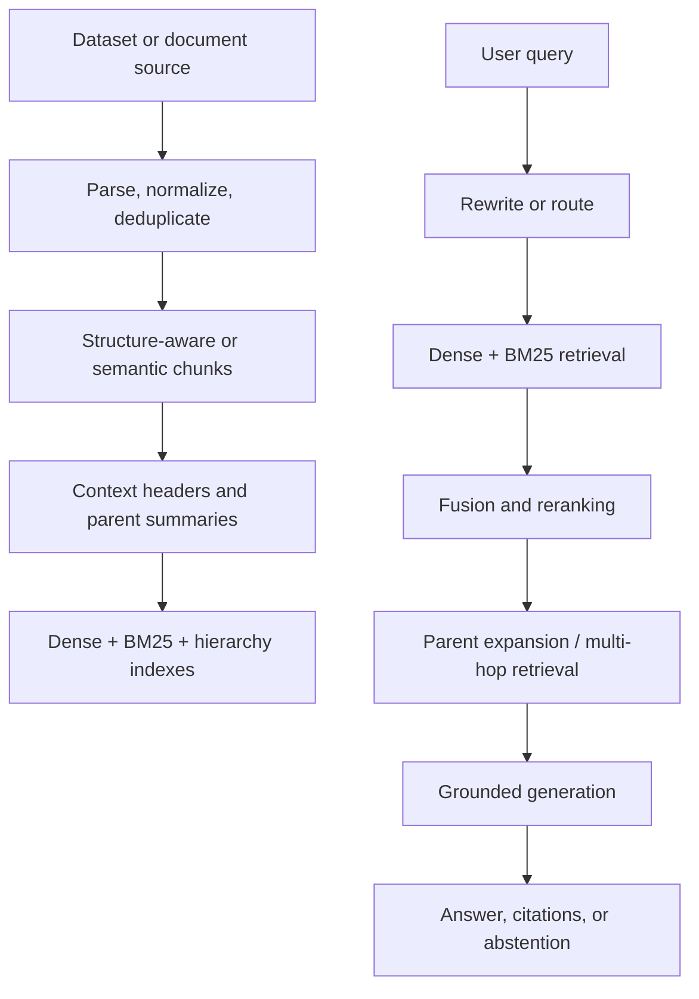

# Development Plan: Benchmark-Driven Production-Grade RAG Prototype

**Status:** Proposed  
**Scope:** Prototype without authentication, authorization, or security hardening  
**Explicitly excluded:** Contextual compression  
**Planning assumption:** One primary developer; phases are capability-based rather than tied to calendar dates

## 1. Objective

Build a modular RAG application that can ingest heterogeneous corpora, perform high-quality hybrid retrieval, generate evidence-grounded answers with citations and abstention, and measure every change against a reproducible benchmark suite.

The prototype should support:

- Structure-aware and semantic chunking
- Contextual chunk headers
- Dense and BM25 retrieval
- Rank fusion
- Reranking
- Metadata filtering
- Hierarchical/parent-child indices
- Conditional HyDE retrieval
- Conditional query rewriting and multi-hop decomposition
- Evidence-grounded generation with citations
- Abstention when evidence is insufficient
- Dataset and index versioning
- Offline evaluation, experiment comparison, and regression detection
- Runtime tracing, latency/cost measurement, caching, retries, and fallbacks

The goal is not to activate every mechanism for every query. The default path stays simple, while HyDE, hierarchy, and multi-hop retrieval are selected only when evaluations show that they help.

## 2. Scope Decisions

### Included now

1. Benchmark-driven development
2. Deterministic ingestion and index builds
3. Hybrid dense + BM25 retrieval
4. Contextual headers generated during ingestion
5. Cross-encoder or equivalent reranking
6. Metadata filters
7. Hierarchical parent-child retrieval
8. Conditional HyDE
9. Query rewriting for conversational or ambiguous queries
10. Multi-hop decomposition/iterative retrieval for multi-hop datasets
11. Citations and evidence-backed abstention
12. Observability and operational failure handling

### Deferred

- Authentication and tenant isolation
- Authorization and document ACL enforcement
- Prompt-injection and adversarial security hardening
- Encryption and compliance controls
- Contextual compression
- Fine-tuning embeddings, rerankers, or generators
- Agent frameworks unless multi-hop routing becomes too complex for an explicit state machine
- Full multimodal retrieval in the first iteration

Security is deferred for prototype speed, but the document and chunk schemas should reserve fields such as `tenant_id` and `access_tags` so adding authorization later does not require an index redesign.

## 3. Guiding Principles

1. **Evals before sophistication:** No advanced mechanism is promoted to the default path without a measured improvement.
2. **Retrieval and generation are evaluated separately:** A correct final answer must not hide poor retrieval, and good retrieval must not hide unsupported generation.
3. **Raw evidence remains authoritative:** Generated headers and summaries are retrieval aids, not source material.
4. **Every result is reproducible:** Dataset version, index version, model versions, prompts, thresholds, and configuration are stored with each run.
5. **Feature flags over branching codebases:** Each retrieval mechanism is configurable and ablatable.
6. **One canonical internal schema:** Dataset-specific formats are converted at the boundary.
7. **Test sets remain untouched:** Development and threshold tuning use train/dev subsets only.

## 4. Recommended Prototype Stack

| Concern | Recommended default | Reason |
| --- | --- | --- |
| Language | Python 3.12+ | Strongest ecosystem for datasets, retrieval, and evaluation |
| API | FastAPI + Pydantic | Typed request/response contracts and simple async endpoints |
| Search engine | [OpenSearch](https://docs.opensearch.org/latest/tutorials/vector-search/neural-search-tutorial/) | BM25, vector/hybrid search, filters, and index aliases in one service |
| Run metadata | SQLite initially | Minimal local setup; replace with PostgreSQL when concurrent workers are needed |
| Raw artifacts | Versioned local directory | Simple prototype behavior; use object storage later |
| Dataset loading | Hugging Face `datasets`, official loaders, custom adapters | Reusable download/cache layer |
| Testing | pytest | Unit, integration, golden, and regression tests |
| Tracing | Structured JSON logs + OpenTelemetry interfaces | Local observability now, external backend later |
| Packaging | `uv` or equivalent locked dependency manager | Reproducible environments |
| Local runtime | Docker Compose | Repeatable OpenSearch and API environment |

Do not introduce LangGraph or another workflow engine initially. The query pipeline can be represented by typed services and a small explicit state machine. Reconsider a graph framework only if adaptive multi-hop execution becomes difficult to inspect or test.

## 5. System Architecture



Cross-cutting services:

- Configuration and feature flags
- Dataset/index/model/prompt versioning
- Evaluation runner
- Trace and cost recorder
- Cache and retry policy

## 6. Canonical Data Contracts

### Document

```python
class Document:
    document_id: str
    source_uri: str | None
    source_version: str
    title: str | None
    text: str
    mime_type: str
    metadata: dict
    content_hash: str
    effective_at: datetime | None
    ingested_at: datetime
```

### Chunk

```python
class Chunk:
    chunk_id: str
    document_id: str
    parent_id: str | None
    level: int
    raw_text: str
    contextual_header: str | None
    retrieval_text: str
    locator: dict       # page, section, paragraph, sentence offsets
    token_count: int
    metadata: dict
    content_hash: str
```

`retrieval_text` may contain the contextual header plus raw text. The generator should receive `raw_text`, source metadata, and clearly labeled generated context separately.

### Benchmark example

```python
class BenchmarkExample:
    example_id: str
    dataset_name: str
    dataset_version: str
    split: str
    task_type: str
    query: str
    reference_answers: list[str]
    relevant_document_ids: list[str]
    evidence_sets: list[list[str]]
    label: str | None
    answerable: bool | None
    metadata: dict
```

### Experiment configuration

```python
class ExperimentConfig:
    chunker: dict
    contextual_headers: dict
    embedding_model: str
    sparse_retriever: dict
    fusion: dict
    reranker: dict | None
    hyde: dict | None
    hierarchy: dict | None
    query_router: dict
    generator_model: str
    prompt_version: str
    retrieval_k: int
    rerank_k: int
    context_token_budget: int
    abstention_thresholds: dict
```

## 7. Query Execution Paths

### Default path

```text
query
  -> metadata filters
  -> dense retrieval + BM25 retrieval
  -> reciprocal-rank fusion
  -> reranking
  -> deduplication and context budgeting
  -> grounded answer with citations or abstention
```

### Conditional paths

| Condition | Additional behavior |
| --- | --- |
| Follow-up/conversational query | Rewrite into a standalone query while retaining the original query for generation |
| Vague semantic query | Run HyDE; fuse direct-query and HyDE result lists |
| Long document or broad summary query | Search parent summaries and leaf chunks, then expand selected parents |
| Multi-hop query | Decompose into subqueries, retrieve iteratively, and require complete evidence-set coverage |
| Low retrieval confidence | Widen retrieval once or abstain; do not loop indefinitely |

All conditional paths must have maximum step counts and fall back to the default path on timeout or provider failure.

## 8. Development Phases

### Indicative effort

For one experienced developer, the sequential plan is roughly **10–14 weeks** to a well-instrumented prototype. This is an engineering estimate, not a commitment; PDF parsing quality, full-corpus indexing time, model-provider integration, and dataset inconsistencies are the largest variables.

| Workstream | Indicative effort |
| --- | --- |
| Foundation and adapters | 1.5–2.5 weeks |
| Ingestion and index lifecycle | 1.5–2 weeks |
| Retrieval baselines, headers, reranking | 1.5–2 weeks |
| Generation, citations, abstention | 1–1.5 weeks |
| Multi-hop, hierarchy, and routed HyDE | 2–3 weeks |
| PDF/dynamic benchmarks and hardening | 2–3 weeks |

### Phase 0 — Project Skeleton and Reproducibility

**Goal:** Establish contracts before implementing retrieval features.

Tasks:

- Create application, ingestion, retrieval, generation, evaluation, and dataset packages.
- Add typed configuration with environment overrides.
- Lock dependencies and create Docker Compose runtime.
- Define the canonical schemas above.
- Define deterministic ID and content-hash rules.
- Create experiment manifests containing dataset, model, prompt, and index versions.
- Add feature flags for every optional mechanism.
- Add unit-test and integration-test jobs.
- Implement structured logging with `trace_id`, `query_id`, and `experiment_id`.

Deliverable:

- API starts locally.
- Empty ingestion and evaluation runs can be created and inspected.
- Repeating a run with the same configuration produces the same manifest.

Exit criteria:

- Configuration is validated at startup.
- No model or prompt identifier is hard-coded inside business logic.
- Dataset test splits cannot be selected by tuning commands.

### Phase 1 — Dataset Adapter Framework

**Goal:** Normalize heterogeneous benchmarks without coupling them to the RAG pipeline.

Tasks:

- Define a `DatasetAdapter` interface:
  - `download()`
  - `version()`
  - `iter_documents()`
  - `iter_examples(split)`
  - `official_metrics()`
  - `validate()`
- Add cache manifests and checksums.
- Validate document IDs referenced by evidence annotations.
- Build small smoke subsets for CI.
- Implement adapters in waves rather than simultaneously.

Wave 1 adapters:

- BEIR
- Natural Questions
- FEVER
- RGB

Wave 2 adapters:

- HotpotQA
- MuSiQue
- MultiHop-RAG

Wave 3 adapters:

- RAGBench
- Open RAG Benchmark
- CRAG

Exit criteria:

- Each adapter emits the same canonical document/example types.
- A validation report lists missing evidence, duplicate IDs, empty text, and split sizes.
- CI can run a 25–100 query smoke evaluation per adapter without downloading full corpora.

### Phase 2 — Deterministic Ingestion and Index Lifecycle

**Goal:** Produce trustworthy, replaceable indexes.

Tasks:

- Implement parsers for plain text, JSON/JSONL, HTML, and text-based PDFs.
- Normalize Unicode, whitespace, headings, and source locators.
- Remove duplicate documents and repeated boilerplate.
- Preserve tables as structured blocks when extraction is reliable.
- Store raw and normalized artifacts separately.
- Implement structure-aware chunking first:
  - honor headings, paragraphs, lists, tables, and code blocks
  - enforce minimum/maximum token sizes
  - add limited overlap only when boundaries lose necessary context
- Add semantic chunking behind a feature flag.
- Build parent-child relationships from document -> section -> leaf chunk.
- Add incremental create/update/delete processing.
- Use versioned physical indexes plus an alias for atomic activation.
- Persist ingestion failures to a dead-letter report.

Exit criteria:

- Re-ingesting unchanged documents creates no duplicate chunks.
- Updating or deleting a document removes stale chunks.
- Every chunk resolves back to an exact document locator.
- Index builds are immutable and identified by a manifest hash.

### Phase 3 — Retrieval Baselines

**Goal:** Establish measured baselines before adding advanced techniques.

Implement these experiment configurations:

| ID | Configuration |
| --- | --- |
| B0 | BM25 only |
| B1 | Dense retrieval only |
| B2 | Dense + BM25 with reciprocal-rank fusion |

Tasks:

- Implement retriever interfaces independent of OpenSearch.
- Add metadata/date/domain filters.
- Implement Reciprocal Rank Fusion as the initial fusion method.
- Deduplicate overlapping chunks and repeated source documents.
- Record raw ranks, scores, and fused ranks.
- Tune `retrieval_k` only on development splits.
- Benchmark retrieval latency and index size.

Primary datasets:

- BEIR for heterogeneous retrieval and nDCG/Recall
- Natural Questions for single-hop passage retrieval
- FEVER for evidence retrieval and unanswerable claims

Exit criteria:

- B0, B1, and B2 produce comparable experiment reports.
- Hybrid retrieval beats or matches the stronger single retriever across the selected aggregate metric without unacceptable latency regression.
- Per-dataset results are retained; aggregate scores never hide a major dataset regression.

### Phase 4 — Contextual Headers and Reranking

**Goal:** Improve precision while keeping source evidence intact.

Add configurations:

| ID | Configuration |
| --- | --- |
| B3 | B2 + contextual chunk headers |
| B4 | B3 + reranker |

Tasks:

- Generate concise chunk-specific context during ingestion.
- Store header prompt, model version, and output hash.
- Keep `raw_text` unchanged.
- Embed and BM25-index `contextual_header + raw_text`.
- Implement batch reranking of the fused candidate set.
- Tune candidate count and final context count separately.
- Add a check for contextual headers that introduce unsupported named entities, dates, or numbers.
- Compare structure-aware and semantic chunking through ablations.

Exit criteria:

- Contextual headers and reranking have separate ablation results.
- Citation locators continue to point to raw evidence rather than generated headers.
- Reranking improves precision/Recall@K or end-to-end correctness enough to justify measured latency and cost.

### Phase 5 — Grounded Generation, Citations, and Abstention

**Goal:** Return useful answers without concealing missing or conflicting evidence.

Tasks:

- Define a strict generation response schema:
  - answer
  - cited chunk IDs
  - claim-to-citation mapping
  - confidence/reason code
  - abstention flag
- Require citations for factual claims.
- Validate that citation IDs were in the supplied context.
- Render source title, URI, page, and section where available.
- Detect conflicting retrieved sources and instruct the model to surface the conflict.
- Calibrate abstention using retrieval features and answerability examples.
- Distinguish:
  - no relevant evidence
  - incomplete multi-hop evidence
  - conflicting evidence
  - generation/provider failure
- Add exact-match/F1 task metrics alongside citation and faithfulness metrics.

Primary datasets:

- Natural Questions for answer correctness
- FEVER for Supported/Refuted/NotEnoughInfo behavior
- RGB for noise robustness, rejection, integration, and counterfactual robustness
- RAGBench for grounded end-to-end behavior across domains

Exit criteria:

- Every non-abstaining factual answer has at least one valid citation.
- Citation precision/recall and abstention metrics appear in regression reports.
- Failure states are machine-readable and are not returned as fabricated answers.

### Phase 6 — Multi-Hop and Hierarchical Retrieval

**Goal:** Support questions whose evidence spans documents or abstraction levels.

Tasks:

- Create section-level parent nodes and document-level summaries.
- Index summaries separately from leaf evidence.
- Retrieve across levels and expand selected parent nodes to evidence chunks.
- Implement a bounded multi-hop state machine:
  1. classify likely hop complexity
  2. generate one or more subqueries
  3. retrieve/rerank evidence for each subquery
  4. update unresolved entities or relations
  5. stop at complete evidence, configured hop limit, or low confidence
- Preserve the original query and subquery provenance.
- Measure complete evidence-set recall, not merely whether one supporting document was found.
- Prevent duplicate evidence from consuming the context budget.

Primary datasets:

- HotpotQA for two-document reasoning and supporting facts
- MuSiQue for less shortcut-prone 2–4 hop reasoning
- MultiHop-RAG for evidence across 2–4 documents and metadata-sensitive questions

Exit criteria:

- Multi-hop routing improves complete evidence-set recall over B4.
- The router does not send most single-hop questions through the expensive path.
- Every iterative retrieval trace has a bounded step count and can be replayed.

### Phase 7 — Conditional HyDE and Query Routing

**Goal:** Use expensive query transformation only where it helps.

Add configurations:

| ID | Configuration |
| --- | --- |
| B5 | B4 + HyDE for routed queries |
| B6 | B4 + hierarchy/multi-hop for routed queries |
| B7 | Adaptive router choosing B4/B5/B6 |

Tasks:

- Generate a hypothetical passage without treating it as evidence.
- Retrieve using both the original query and HyDE embedding.
- Fuse result lists rather than replacing the original query.
- Add simple rule-based routing first using:
  - query specificity
  - presence of exact identifiers
  - conversational dependency
  - likely multi-hop relations
  - requested summary scope
- Log router reason codes.
- Compare always-on, routed, and disabled HyDE.
- Fall back to direct hybrid retrieval if the HyDE call fails or times out.

Exit criteria:

- Routed HyDE improves its target slice without reducing overall correctness.
- The added p95 latency and cost are visible in reports.
- HyDE output never appears as a citation or source.

### Phase 8 — PDF, Domain, and Dynamic-Knowledge Stress Tests

**Goal:** Test realistic ingestion and changing knowledge without prematurely turning the prototype into a multimodal agent.

Tasks:

- Run Open RAG Benchmark first on text-extractable PDF questions.
- Report table/image-dependent questions as a separate unsupported slice.
- Add table extraction and layout-aware locators only after the text path is stable.
- Use RAGBench to evaluate domain variation and industry-style corpora.
- Implement CRAG as a separate retrieval-provider adapter because it includes mock web and knowledge-graph APIs.
- Keep static-corpus RAG scores separate from dynamic/API retrieval scores.
- Add time-sensitive and long-tail query slices.

Exit criteria:

- PDF extraction failures are measured separately from retrieval failures.
- CRAG does not force web/KG assumptions into the core static retriever interface.
- Unsupported multimodal cases are explicitly reported rather than counted as unexplained model failures.

### Phase 9 — Observability and Prototype Hardening

**Goal:** Make failures diagnosable and the prototype reliable enough for sustained testing.

Tasks:

- Trace each pipeline stage and model/provider call.
- Store retrieved IDs, raw/fused/reranked scores, context sent to the model, citations, and router decisions.
- Track p50/p95 latency, tokens, estimated cost, cache hits, and error rate.
- Add request timeouts and bounded retries with exponential backoff.
- Add caches for embeddings, contextual headers, HyDE outputs, and deterministic benchmark generations.
- Add provider fallback behavior where practical.
- Add health/readiness endpoints.
- Add index alias rollback.
- Build a minimal inspection UI:
  - enter query
  - view retrieved and reranked chunks
  - view source locators and citations
  - compare two experiment configurations
- Add user feedback capture without using it automatically as ground truth.

Exit criteria:

- A failed answer can be diagnosed from one trace.
- Model/provider failures do not corrupt indexes or experiment records.
- A previous index can be reactivated without rebuilding it.

## 9. Benchmark Strategy

| Dataset | Primary purpose in this project | Priority |
| --- | --- | --- |
| BEIR | Dense/BM25/hybrid retrieval generalization | Wave 1 |
| Natural Questions | Realistic single-hop QA and answerability | Wave 1 |
| FEVER | Evidence retrieval, support/refute classification, insufficient evidence | Wave 1 |
| RGB | Noise robustness, rejection, integration, counterfactual resistance | Wave 1 |
| HotpotQA | Multi-document retrieval and supporting-fact coverage | Wave 2 |
| MuSiQue | Genuine 2–4 hop reasoning with fewer shortcuts | Wave 2 |
| MultiHop-RAG | Cross-document and metadata-aware multi-hop RAG | Wave 2 |
| RAGBench | End-to-end domain diversity and explainable RAG evaluation | Wave 3 |
| Open RAG Benchmark | PDF ingestion and later multimodal/layout evaluation | Wave 3 |
| CRAG | Dynamic, long-tail, temporal, web/KG-style retrieval | Wave 3 |

### Dataset cautions

- BEIR is a collection of datasets, not one workload. Begin with representative subsets instead of running all tasks during every iteration.
- Natural Questions, HotpotQA, MuSiQue, and FEVER share Wikipedia-derived characteristics. Report them individually to avoid overstating corpus diversity.
- Open RAG Benchmark includes text, table, and image questions. A text-only prototype should explicitly slice its results.
- CRAG is not equivalent to static document RAG; its mock APIs deserve a separate provider boundary.
- RGB evaluates robustness of a model given retrieved contexts as well as full-pipeline behavior. Label those experiment modes separately.
- Never tune thresholds or prompts against blind test labels.

## 10. Metrics

### Retrieval

- Recall@5, @10, @20
- Precision@K
- nDCG@10
- MRR
- Relevant document hit rate
- Evidence sentence recall
- Complete evidence-set recall for multi-hop queries
- Retrieval failure rate by query slice

### Generation

- Exact Match and token F1 where official
- Task-specific label accuracy
- FEVER score where applicable
- Answer correctness
- Claim-level faithfulness
- Citation precision and citation recall
- Unsupported-claim rate
- Conflict recognition rate

### Abstention and robustness

- Correct abstention rate
- False abstention rate
- Answer rate on answerable questions
- Noise robustness
- Counterfactual resistance
- Incomplete-evidence refusal rate

### Operations

- Ingestion throughput
- Index size and build duration
- p50/p95 end-to-end latency
- Per-stage latency
- Tokens and estimated cost per query
- Cache hit rate
- Provider and pipeline error rates

## 11. Experiment and Release Gates

Every candidate configuration must be compared with the current baseline using the same dataset version, split, model, prompt, and random seed where supported.

A feature is promoted only when:

1. It improves the metric for its intended query slice.
2. It does not cause a material unexplained regression elsewhere.
3. Its latency and cost increase are recorded and accepted.
4. Its behavior can be disabled through configuration.
5. Its run can be reproduced from a stored manifest.

Do not set arbitrary universal accuracy targets before obtaining baseline results. After B0–B4 are measured, define per-dataset and per-slice regression thresholds from observed variance.

## 12. Suggested Repository Layout

```text
rag-app/
├── app/
│   ├── api/
│   ├── config/
│   ├── domain/
│   ├── ingestion/
│   │   ├── parsers/
│   │   ├── chunkers/
│   │   └── contextualizers/
│   ├── indexing/
│   ├── retrieval/
│   │   ├── dense/
│   │   ├── sparse/
│   │   ├── fusion/
│   │   ├── reranking/
│   │   ├── hyde/
│   │   └── hierarchy/
│   ├── generation/
│   ├── routing/
│   ├── evaluation/
│   └── observability/
├── datasets/
│   ├── adapters/
│   ├── manifests/
│   └── smoke/
├── experiments/
│   ├── configs/
│   └── reports/
├── tests/
│   ├── unit/
│   ├── integration/
│   ├── golden/
│   └── regression/
├── scripts/
├── docker/
├── docs/
└── pyproject.toml
```

Large downloaded corpora, indexes, and generated experiment outputs should not be committed to Git. Commit manifests, smoke fixtures, schemas, and summarized reports.

## 13. Minimal API Surface

| Endpoint | Purpose |
| --- | --- |
| `POST /v1/ingestion-runs` | Start a corpus/index build |
| `GET /v1/ingestion-runs/{id}` | Inspect progress and failures |
| `POST /v1/query` | Execute one configured RAG query |
| `POST /v1/evaluation-runs` | Start an offline benchmark run |
| `GET /v1/evaluation-runs/{id}` | Retrieve metrics and artifact links |
| `GET /v1/traces/{id}` | Inspect retrieval and generation decisions |
| `GET /healthz` | Process health |
| `GET /readyz` | Dependency and active-index readiness |

The query response should include the answer, citations, abstention state, trace ID, and active experiment/index version.

## 14. First Implementation Sequence

The shortest path to a credible working prototype is:

1. Complete Phase 0.
2. Implement BEIR, Natural Questions, and FEVER adapters.
3. Build deterministic structure-aware ingestion.
4. Establish BM25, dense, and hybrid baselines.
5. Add contextual headers and reranking.
6. Add grounded generation, citations, and abstention.
7. Add RGB robustness evaluation.
8. Add HotpotQA, MuSiQue, and MultiHop-RAG.
9. Implement hierarchical and multi-hop paths.
10. Add routed HyDE.
11. Add RAGBench and text-only Open RAG Benchmark.
12. Integrate CRAG through a separate dynamic retrieval provider.
13. Harden observability, caching, retries, rollback, and the inspection UI.

## 15. Prototype Completion Definition

The prototype is considered capable when:

- All ten benchmark adapters validate successfully.
- B0–B7 ablations can be run reproducibly.
- Hybrid retrieval, contextual headers, and reranking have measured results rather than assumed value.
- Single-hop, multi-hop, unanswerable, noisy, conflicting, PDF, and dynamic-knowledge slices are reported separately.
- Answers contain resolvable citations or an explicit abstention reason.
- Index updates and deletions do not leave stale searchable content.
- Every answer has a replayable trace and recorded configuration.
- Latency and cost are visible per stage.
- Optional features fail safely back to the default hybrid path.

At that point, the next milestone is not another retrieval technique. It is security, authorization, deployment architecture, capacity testing, and evaluation on the application's actual domain data.

## 16. Benchmark References

- [BEIR](https://github.com/beir-cellar/beir)
- [Natural Questions](https://github.com/google-research-datasets/natural-questions)
- [HotpotQA](https://hotpotqa.github.io/)
- [MuSiQue](https://github.com/stonybrooknlp/musique)
- [FEVER](https://fever.ai/dataset/fever.html)
- [MultiHop-RAG](https://github.com/yixuantt/MultiHop-RAG/)
- [RAGBench](https://huggingface.co/datasets/galileo-ai/ragbench)
- [Open RAG Benchmark](https://github.com/vectara/open-rag-bench)
- [CRAG](https://github.com/facebookresearch/CRAG/)
- [RGB](https://github.com/chen700564/RGB)
