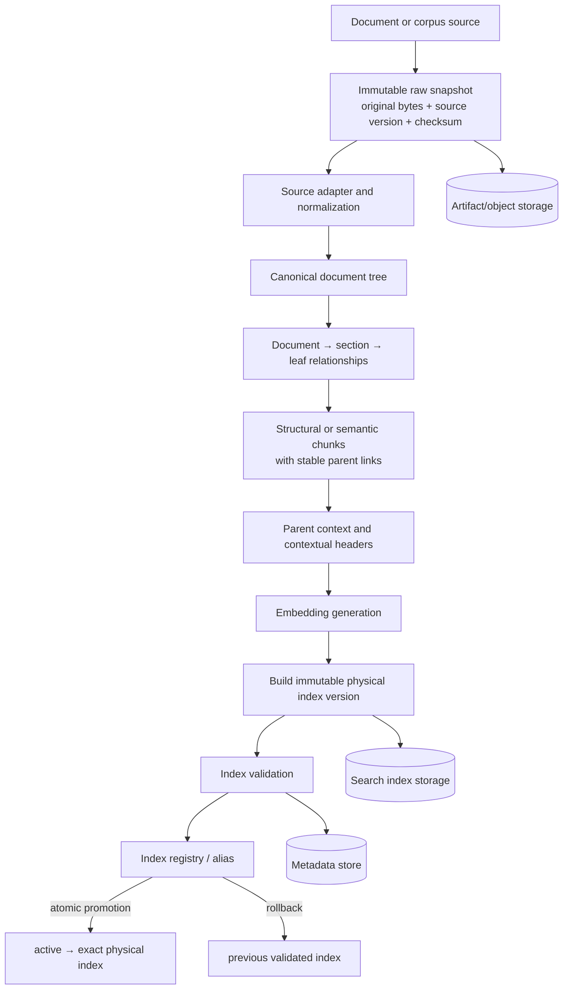
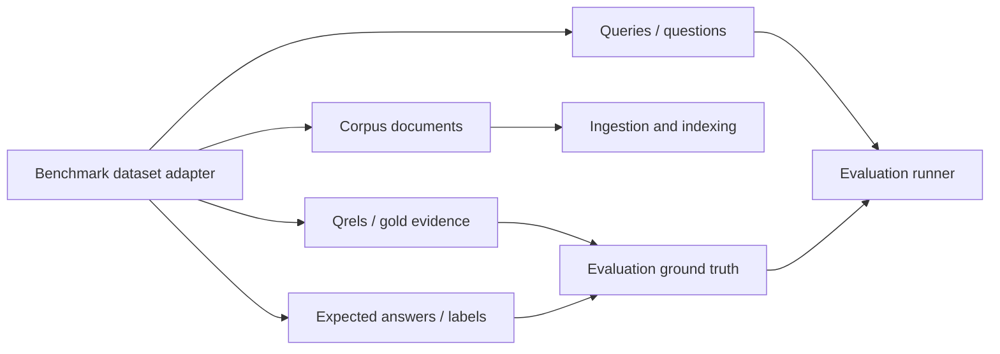
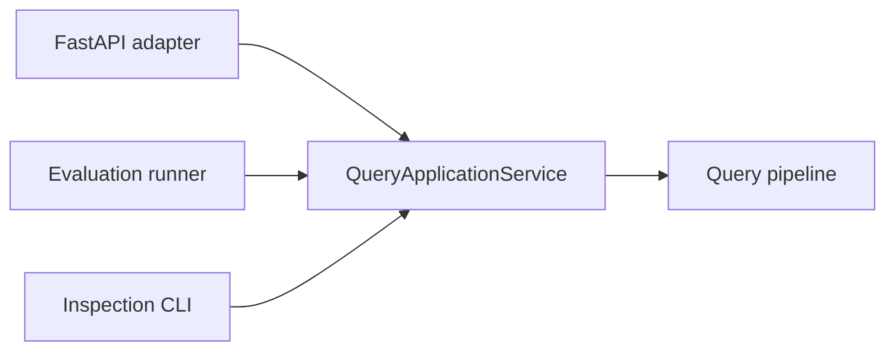
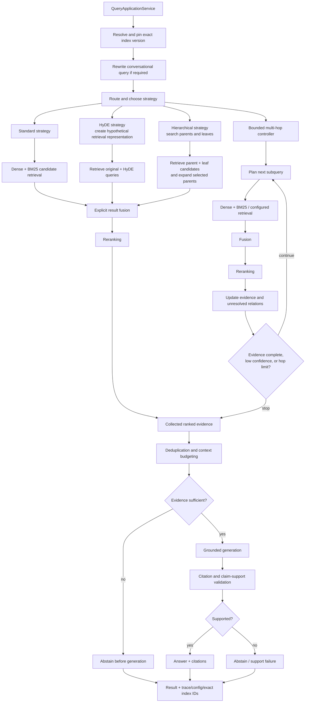
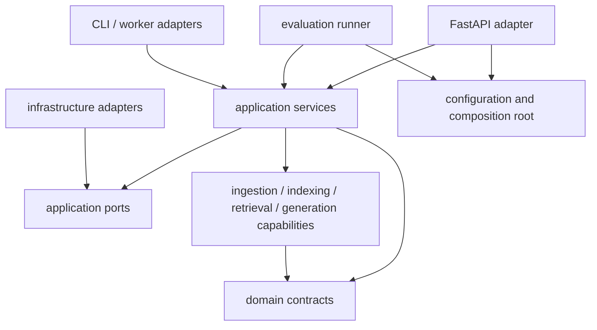

# Repository Structure and Architecture Proposal

**Status:** Revised proposal  
**Applies to:** Phase 0 foundation and the eventual RAG prototype  
**Related plan:** [RAG Application Development Plan](./RAG_APPLICATION_DEVELOPMENT_PLAN.md)  
**Phase 0 execution plan:** [Phase 0 Implementation Plan](./PHASE_0_IMPLEMENTATION_PLAN.md)

## 1. Purpose

This document defines the target architecture, package boundaries, dependency rules, storage responsibilities, and incremental repository layout for the RAG application.

Two views are intentionally separate:

1. **Target architecture** describes the eventual ingestion, query, indexing, and evaluation system.
2. **Phase 0 materialized structure** contains only working foundation code required now.

Later-phase directories must not be created as empty implementations simply to resemble the target diagram.

## 2. Architectural Principles

- FastAPI and the evaluation runner are inbound adapters, not the application core.
- Both adapters call the same `QueryApplicationService` in process; HTTP is reserved for API use and end-to-end testing.
- Query rewriting and strategy selection occur before retrieval.
- HyDE transforms a query before retrieval, hierarchy is a retrieval strategy, and multi-hop is a bounded loop containing retrieval and reranking.
- Original source bytes are stored immutably before parsing.
- Document hierarchy is established before chunks receive contextual enrichment.
- Benchmark corpora, queries, relevance judgments, and expected answers are separate assets.
- Index builds are immutable and become queryable only through validation and atomic promotion.
- Every query resolves and records an exact physical index version.
- Retrieval sufficiency is checked before generation; citation/support validation occurs after generation.
- Metadata, artifacts, telemetry, search indexes, and caches have distinct storage responsibilities.
- Optional behavior is configuration driven and promoted only through evaluation.

## 3. Target System Architecture

### 3.1 Ingestion and index lifecycle



Required ordering:

1. Persist the exact source bytes and checksum.
2. Parse the snapshot into a canonical tree.
3. Establish document, section, and leaf relationships.
4. Create structural or semantic chunks with stable parent links.
5. Produce contextual headers using the known tree and parent context.
6. Generate embeddings and build an immutable physical index.
7. Validate the completed index.
8. Atomically promote the logical alias only after validation.

Failed builds never change the active alias. The previously active index remains available for rollback.

### 3.2 Benchmark asset separation

Dataset adapters expose distinct streams rather than sending every dataset asset through ingestion:



The adapter contract should provide operations equivalent to:

```text
version()
iter_corpus_documents()
iter_queries(split)
iter_relevance_judgments(split)
iter_expected_answers(split)
official_metrics()
validate()
```

An assembled benchmark example may be used inside evaluation, but it is not an ingestion input.

### 3.3 Shared query application service



The application service owns the use-case boundary:

- Accept a provider-neutral query command.
- Resolve and pin the exact index version for the request.
- Coordinate routing, retrieval, generation, validation, and tracing.
- Return a provider-neutral result containing the answer or abstention plus citations and trace/config/index identifiers.

FastAPI maps HTTP contracts to application commands. The evaluator calls the same service directly for normal benchmark execution. Evaluation through HTTP is limited to explicit end-to-end tests.

### 3.4 Query execution and advanced retrieval



Important strategy semantics:

- **HyDE** produces a retrieval representation only. It executes before retrieval and can never be evidence or a citation.
- **Hierarchy** owns parent/leaf search and expansion as a retrieval strategy.
- **Multi-hop** owns a bounded state machine. Each hop performs retrieval, fusion, reranking, and evidence-state update; it is not a post-reranking stage.
- **Fallbacks** return to the standard hybrid strategy on optional-provider timeout or failure where safe.
- **Evidence gating** prevents unnecessary generation when retrieval is clearly insufficient.

### 3.5 Federated dynamic retrieval

Dynamic web, knowledge-graph, or API providers are external/federated retrievers, not hidden OpenSearch indexes.

Each provider boundary must define:

- Per-provider timeout and bounded retry policy
- Provenance on every returned result
- Cache eligibility, key, and freshness policy
- Failure isolation and explicit partial-failure status
- Independent provider scores/ranks
- An explicit merge/fusion step with indexed results
- Provider and data-version information in the trace

Provider failure must not corrupt the indexed path or silently change the meaning of search scores.

## 4. Target Repository Layout

This is the eventual structure. Directories are added only when the corresponding capability is implemented.

```text
rag_app/
├── src/rag_app/
│   ├── api/                         # FastAPI inbound adapter
│   ├── application/                 # Shared use-case services
│   ├── config/
│   ├── domain/
│   ├── ingestion/
│   ├── indexing/
│   ├── retrieval/
│   │   ├── strategies/
│   │   │   ├── standard.py
│   │   │   ├── hyde.py
│   │   │   ├── hierarchical.py
│   │   │   └── multi_hop.py
│   │   ├── dense/
│   │   ├── sparse/
│   │   ├── fusion/
│   │   └── reranking/
│   ├── generation/
│   ├── datasets/
│   ├── evaluation/                  # Evaluation inbound adapter/runner
│   ├── observability/
│   └── infrastructure/
│       ├── opensearch/
│       ├── sqlite/
│       ├── artifacts/
│       ├── telemetry/
│       ├── models/
│       ├── federated_retrievers/
│       └── cache/
├── tests/
│   ├── unit/
│   ├── integration/
│   ├── golden/
│   ├── regression/
│   └── fixtures/
├── datasets/
│   ├── manifests/
│   └── smoke/
├── experiments/
│   ├── configs/
│   └── reports/
├── var/                             # Generated local data; ignored by Git
├── notebooks/
├── docs/
├── .github/workflows/
├── .env.example
├── .gitignore
├── compose.yaml
├── pyproject.toml
├── uv.lock
└── README.md
```

There is no separate top-level `routing` package in the proposal. Strategy selection belongs to the query application flow, while each retrieval strategy owns its own bounded mechanics. Routing code may be factored within `application/query_routing.py` when it has real behavior.

## 5. Phase 0 Materialized Layout

Phase 0 creates only the following working packages and files. Later capability directories are absent until their implementation phase.

```text
src/rag_app/
├── __init__.py
├── main.py
├── api/
│   ├── app.py
│   ├── dependencies.py
│   ├── errors.py
│   ├── middleware.py
│   └── routes/
│       ├── health.py
│       └── runs.py
├── application/
│   ├── ports.py                     # Run/artifact/health protocols used now
│   ├── readiness.py
│   └── runs.py
├── config/
│   ├── loader.py
│   └── models.py
├── domain/
│   ├── benchmarks.py
│   ├── documents.py
│   ├── errors.py
│   ├── experiments.py
│   ├── identifiers.py
│   ├── indexes.py
│   ├── queries.py
│   └── runs.py
├── observability/
│   ├── context.py
│   └── logging.py
└── infrastructure/
    ├── artifacts/
    │   └── local.py
    ├── opensearch/
    │   └── health.py
    └── sqlite/
        ├── migrations/
        └── runs.py
```

Every listed Phase 0 module must provide tested behavior. In particular:

- `application/runs.py` implements queued run creation and inspection.
- `application/readiness.py` coordinates dependency checks.
- API routes delegate to these application services.
- Domain contracts establish the future `QueryApplicationService` input/output boundary, but no query pipeline, retrieval strategy, evaluator, index registry, or worker is implemented in Phase 0.

The first query-capable phase adds `application/queries.py` as the shared `QueryApplicationService`. Both FastAPI and evaluation then call that service. It must not be implemented independently in either adapter.

## 6. Package Responsibilities

| Package | Owns | Does not own |
| --- | --- | --- |
| `api` | HTTP validation, status codes, middleware, application-service wiring | Use-case or RAG pipeline logic |
| `application` | Use-case coordination, transaction boundaries, exact index resolution, shared query service | HTTP details or provider SDK behavior |
| `config` | Typed settings, overrides, startup validation | Runtime use-case decisions |
| `domain` | Canonical values, states, identifiers, and errors | FastAPI, OpenSearch, SQLite, or model SDK code |
| `ingestion` | Snapshot-to-document-tree and chunk/enrichment orchestration | Raw-source storage implementation or index activation |
| `indexing` | Immutable builds, validation, registry, activation, rollback | Parsing and contextual generation |
| `retrieval` | Strategies, retrievers, fusion, reranking, multi-hop state | API rendering or final generation |
| `generation` | Grounded generation and claim/citation support validation | Retrieval |
| `datasets` | Separate corpus/query/qrel/answer adapter streams | Evaluation orchestration |
| `evaluation` | Direct application-service execution, metrics, comparison, regression | A duplicate query pipeline or normal HTTP execution |
| `observability` | Correlation context, event conventions, metrics interfaces | Durable metadata or business policy |
| `infrastructure` | Concrete search, metadata, artifact, telemetry, model, cache, and provider adapters | Domain policy |

## 7. Dependency Rules



Rules:

1. `domain` contains no FastAPI, OpenSearch, SQLite, or model-provider imports.
2. Inbound adapters call application services; they do not call retrieval or persistence implementations directly.
3. The evaluation runner calls `QueryApplicationService` in process for normal runs.
4. Application and capability services depend on narrow protocols, not concrete infrastructure classes.
5. `infrastructure` implements those protocols and owns external SDK behavior.
6. Only the configuration/composition root reads environment variables and selects concrete implementations.
7. Dataset-specific behavior remains inside dataset adapters.
8. Generated context is a retrieval aid and never authoritative evidence.
9. Optional paths are selected through configuration and typed routing decisions.
10. Future capability packages are created only with their first working implementation and tests.

## 8. Index Resolution and Rollback Contract

Indexing uses immutable physical indexes and a logical alias/registry:

```text
build index_v17
  -> validate index_v17
  -> atomically set active alias to index_v17
  -> retain index_v16 as a rollback candidate
```

At query start, the application service resolves `active` once to an immutable `ResolvedIndexReference` containing at least:

```text
logical_name
physical_index_name
index_manifest_hash
corpus_snapshot_version
embedding_model_version
resolved_at
```

That reference is pinned for the full query or evaluation example and recorded with the result. An evaluation run records the exact index version at run start and must not silently follow alias changes during the run.

## 9. Storage Responsibilities

| Store | Responsibilities | Explicit exclusions |
| --- | --- | --- |
| SQLite initially / PostgreSQL later | Run IDs, status lifecycle, experiment metadata, artifact references, idempotency keys | Raw documents, large manifests/reports, traces/spans |
| Artifact/object storage | Immutable raw source bytes, source descriptors, manifests, evaluation outputs, reports | Queryable search indexes, operational run state |
| OpenSearch | Versioned BM25/vector indexes and index aliases | Authoritative raw artifacts or run metadata |
| Telemetry backend | Traces, spans, latency, token/cost events, provider failures | Experiment truth or source artifacts |
| Cache | Embeddings and other recomputable, version-keyed values | Authoritative records |

Phase 0 uses SQLite for metadata, local versioned directories for artifacts, and structured JSON logs through a telemetry interface. It does not turn SQLite into a tracing database.

## 10. Long-Running Run Contract

Ingestion and evaluation APIs create work; they do not perform long-running work inside the HTTP request:

```text
POST run request
  -> application service validates request
  -> persist run as queued
  -> return 202 + run ID/location
  -> worker claims run in a later phase
  -> worker updates status and artifact references
```

Phase 0 implements creation, idempotency, lifecycle rules, and inspection. It does not add a queue or worker. Later worker/queue adapters use the same application services and run contracts.

## 11. Source-Control and Artifact Policy

Commit application/test code, dependency locks, schemas, migrations, non-secret configuration examples, small redistributable fixtures, dataset manifests/checksums, experiment configurations, prompt versions, summarized reports, and documentation.

Do not commit credentials, `.env`, full corpora, source snapshots, indexes, SQLite runtime databases, caches, raw traces, large evaluation outputs, notebook checkpoints, or IDE state. Generated local data belongs under `var/` and is ignored except for documentation of the directory contract.

## 12. Testing Boundaries

```text
tests/
├── unit/           # Pure domain/application behavior
├── integration/    # SQLite, artifact store, OpenSearch health, FastAPI
├── golden/         # Canonical serialization and immutable manifests
├── regression/     # Added with benchmark capabilities
└── fixtures/       # Small redistributable inputs
```

Application-service tests are the primary functional tests. API tests verify mapping and middleware. A small number of end-to-end tests may use HTTP; evaluation correctness and performance tests call the shared service directly.

## 13. Current Repository Migration

The current repository contains the master plan, these architecture documents, an empty `notebooks/` directory, and a root data-collection notebook. During Phase 0:

1. Materialize only the Phase 0 tree in Section 5.
2. Move the notebook to `notebooks/data_collection/` in a dedicated change.
3. Add artifact exclusions before running data or index jobs.
4. Initialize Git only if this directory is confirmed as the intended repository root.
5. Do not add empty later-phase packages to make the repository resemble Section 4.

## 14. Decision Summary

| Decision | Choice |
| --- | --- |
| Application core | Shared application services below all inbound adapters |
| Evaluation execution | Direct `QueryApplicationService` calls; HTTP only for E2E tests |
| Advanced retrieval | Strategy selected before retrieval; bounded multi-hop loop |
| Source reproducibility | Immutable original bytes stored before parsing |
| Enrichment order | Document tree and parent links before contextual headers |
| Benchmark contract | Corpus, queries, qrels, and answers exposed separately |
| Index lifecycle | Immutable build, validation, atomic promotion, rollback |
| Query index identity | Exact resolved physical index pinned and recorded |
| Abstention | Retrieval sufficiency gate plus post-generation support gate |
| Dynamic providers | Federated retrievers with isolation, provenance, and explicit merging |
| Phase 0 structure | Only working foundation modules; no empty future packages |
